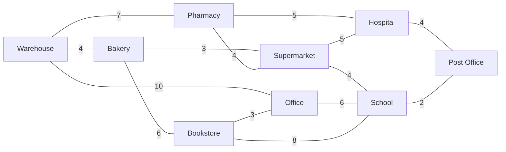
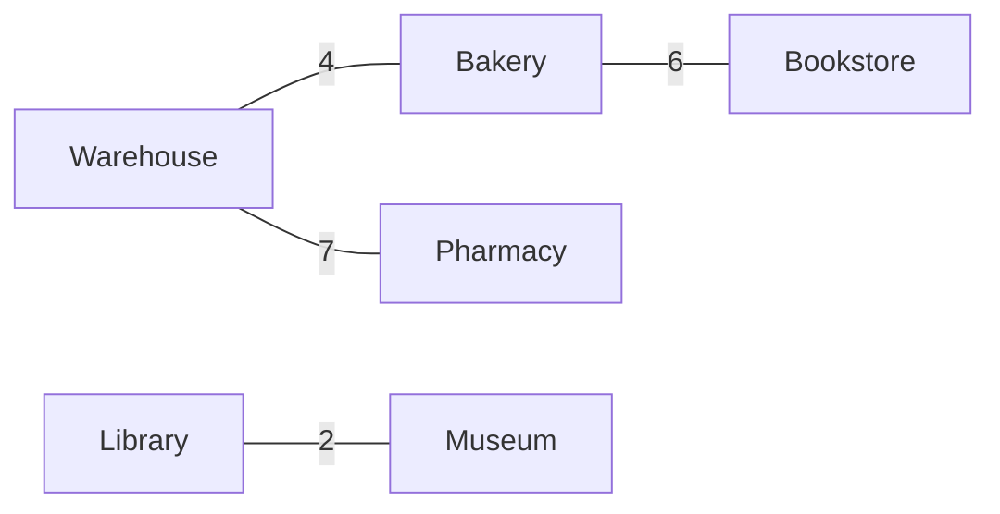

# DeliveryRoutePlanner

DeliveryRoutePlanner is a console-based Java application for planning delivery routes on a small city map.

The city is represented as a weighted graph. Locations are vertices, roads are edges, and road distances are weights.

## Project Context

The application helps a delivery driver to:

- show all available locations;
- show the road network;
- find the shortest path between two locations;
- show all locations reachable from a start location;
- plan an approximate delivery route through several stops.

## Graph Data Source

The city map is stored in a CSV file:

```text
data/city-map.csv
```

This makes it easy to change roads or distances without editing the Java classes.

CSV format:

```csv
from,to,distance
Warehouse,Bakery,4
Warehouse,Pharmacy,7
```

Each row describes one undirected road. `GraphCsvReader` reads the file and adds the road in both directions.

Additional CSV files are used by tests:

- `data/disconnected-map.csv` checks unreachable locations and contains a separate test-only component, `Library -- Museum`;
- `data/invalid-map.csv` checks invalid input handling.

## Data Structure

The main data structure is a weighted graph with an adjacency list.

In Java, the graph is stored as:

```java
Map<String, List<Edge>>
```

Where:

- `String` is the location name;
- `List<Edge>` is the list of roads from this location;
- `Edge` stores the target location and the road weight.

This structure is useful because each location directly stores its neighboring locations.

## Algorithms

### 1. Dijkstra's Algorithm

Used to find the shortest path between two locations.

Example:

```text
Start: Warehouse
Destination: Hospital
```

Result:

```text
Warehouse -> Pharmacy -> Hospital
Total distance: 12
```

The implementation uses a simple loop instead of a priority queue. This makes the code easier to understand for a small educational project.

Runtime: $O(V^2 + E)$

### 2. Breadth-First Search (BFS)

Used to show all locations reachable from a start location.

BFS counts the number of steps, not the weighted distance.

Example:

```text
0 step(s): Warehouse
1 step(s): Bakery
1 step(s): Pharmacy
2 step(s): Supermarket
```

Runtime: $O(V + E)$

### 3. Greedy Nearest Neighbor

Used to build an approximate delivery route through several stops.

The algorithm starts at the selected location and repeatedly chooses the nearest unvisited delivery stop. It uses Dijkstra to calculate the shortest path to each possible next stop.

Greedy chooses only the next required delivery stop. The shortest path to that stop may pass through other locations that are not delivery stops.

This algorithm is fast and easy to understand, but it does not always guarantee the globally optimal route.

Runtime for `k` delivery stops: $O(k^2 \cdot (V^2 + E))$

At each step, the algorithm compares all remaining delivery stops. For each possible next stop, it calls Dijkstra to find the shortest path from the current location.

## Project Structure

```text
data
|-- city-map.csv
|-- disconnected-map.csv
`-- invalid-map.csv

src/main/java/at/ac/hcw/delivery
|-- Main.java
|-- DeliveryApp.java
|-- Graph.java
|-- GraphCsvReader.java
|-- Edge.java
|-- PathResult.java
|-- Dijkstra.java
|-- BreadthFirstSearch.java
`-- DeliveryRoutePlanner.java

src/test/java/at/ac/hcw/delivery
`-- DeliveryRoutePlannerTest.java
```

## How To Run

Open the project in IntelliJ IDEA and run:

```text
at.ac.hcw.delivery.Main
```

The application starts a console menu:

```text
1. Show all locations
2. Show all roads
3. Find shortest path
4. Show reachable locations
5. Plan delivery route
6. Exit
```

## How To Run Tests

The project uses JUnit 5. Each test method checks one function or one business scenario separately, so IntelliJ can show exactly which test passed or failed.

In IntelliJ IDEA, open `src/test/java/at/ac/hcw/delivery/DeliveryRoutePlannerTest.java` and run the test class or a single test method.

If Maven is available, run:

```text
mvn test
```

Expected result:

```text
BUILD SUCCESS
```

The tests cover:

- CSV graph loading;
- invalid CSV distances;
- case-insensitive location lookup;
- Dijkstra shortest path, same-location path, unknown locations, and unreachable destinations;
- BFS step counting and disconnected components;
- greedy route planning with delivery stops, no stops, and unreachable stops.

## Example City Map

The example city map is stored in `data/city-map.csv`. The same graph can be viewed as a scheme:



All roads are undirected and must have non-negative weights.

## Test Disconnected Map

`data/disconnected-map.csv` is not the main application map. It is a smaller test fixture used to check that Dijkstra, BFS, and greedy route planning correctly handle unreachable locations.


